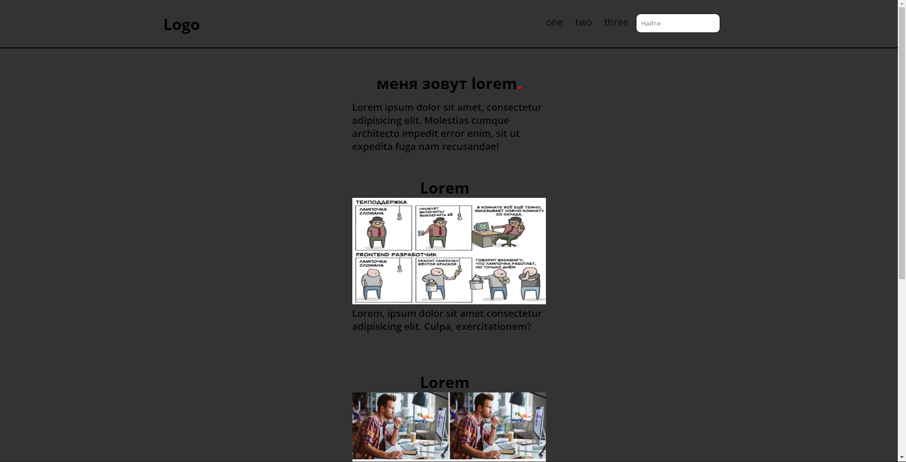

<html>
  <h1>это пример сайта который вы должны сделать 🧰</h1>
  
не обезательно делать такой же, просто нужно сделать сайт в котором есть header main и footer 

  
  <h1>А вот что за сайт у меня получился</h1>
  
  

  <h1>Так же полезно🔥</h1>
  
Всякие документации и шпаргалки

  <a href='https://htmlbase.ru/'>Шпаргалка-документация по css и html</a>
</html>
